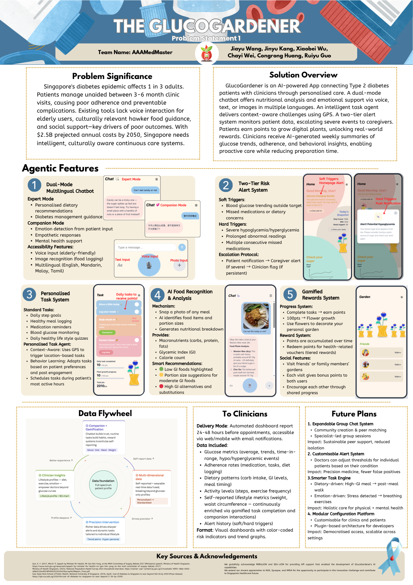

# The GlucoGardener

AI-powered chronic disease management platform for diabetic patients in Singapore. Built for the **SG INNOVATION** competition.

## Poster



## Presentation

- [Presentation Slides (PDF)](docs/presentation-slides.pdf)
- [Demo Video (Google Drive)](https://drive.google.com/drive/folders/1p6h_YFwAAUWyiWDxKaYO_nvAUaOvfyBL?usp=sharing)

---

## Platform Overview

| Module | Directory | Status | Description |
|--------|-----------|--------|-------------|
| **Health Companion Chatbot** | `chatbot/` | ✅ Backend ready | Multi-turn conversational agent with intent routing, emotion awareness, streaming responses |
| **Vision Agent** | `src/vision_agent/` | ✅ Backend ready | Analyzes food photos, medication images, and medical reports → structured JSON |
| **Task System** | `frontend/src/app/task/` | 🟡 Frontend only | Daily health task management (meal logging, exercise, check-ins) |
| **Alert System** | `frontend/src/app/soft-alert/`, `hard-alert/` | 🟡 Frontend only | Soft & hard alerts for glucose/heart rate anomalies |
| **Garden** | `frontend/src/app/garden/` | 🟡 Frontend only | Gamification — grow your garden by completing health tasks |
| **Settings** | `frontend/src/app/setting/` | 🟡 Frontend only | User profile and preferences |

> Task Agent and Alert Agent are developed in separate repos. Frontend pages are ready; backend integration is in progress.
> - Task Agent: [SG-Innovation-Agents](https://github.com/Verse-Founder/SG-Innovation-Agents)
> - Alert Agent: [Diabetes_Guardian](https://github.com/juliawangjiayu/Diabetes_Guardian)

---

## Quick Start

### 1. Backend Setup

```bash
git clone <repo-url>
cd SG_INNOVATION

# Create virtual environment
python3 -m venv .venv
source .venv/bin/activate

# Install dependencies
pip install -r requirements.txt

# Configure API keys
cp .env.example .env
# Edit .env with your API keys
```

### 2. Start Backend

```bash
uvicorn chatbot.api.main:api --reload --port 8080
```

### 3. Start Frontend

```bash
cd frontend
npm install
npm run dev
# Open http://localhost:3000
```

---

## Architecture

### System Overview

```
User → Frontend (Next.js)
         ├── /chat        → Chatbot API (FastAPI :8080)
         ├── /task         → Task Agent (Chayi) [TBD]
         ├── /soft-alert   → Alert Agent (Julia) [TBD]
         ├── /hard-alert   → Alert Agent (Julia) [TBD]
         ├── /garden       → Gamification [TBD]
         └── /setting      → User Settings [TBD]
```

### Chatbot Flow (LangGraph)

```
User Input (text / image / voice)
    |
input_node       ← detects images → calls Vision Agent; voice → MeraLion STT
    |
glucose_reader   ← fetches weekly glucose & diet history
    |
triage_node      ← keyword pre-classification + LLM fallback (intent + emotion)
    |                + background RAG prefetch for medical queries
    |
    +── Expert Agent     ← medical Q&A, diet advice, glucose analysis
    +── Companion Agent  ← emotional support, daily conversation
    |
history_update   ← persist conversation to SQLite via LangGraph checkpointer
```

### Vision Agent Pipeline (LangGraph)

```
[Image Input(s)]
     |
[image_intake]        Receive image(s), validate, convert to base64
     |
[scene_classifier]    Classify: FOOD / MEDICATION / REPORT / UNKNOWN
     |
     +── FOOD       → [food_analyzer]       Identify dishes, estimate nutrition
     +── MEDICATION → [medication_reader]    Extract drug name, dosage, frequency
     +── REPORT     → [report_digitizer]     Extract lab indicators (HbA1c, glucose)
     +── UNKNOWN    → [rejection_handler]    Reject non-target images
     |
[output_formatter]    Validate with Pydantic → unified JSON output
```

---

## API Endpoints

| Method | Endpoint | Description |
|--------|----------|-------------|
| POST | `/chat/message` | Send message, get full response |
| POST | `/chat/stream` | Send message, get streaming SSE response |

Both endpoints accept `FormData` with fields: `user_id`, `session_id`, `text`, `image`, `audio`.

---

## Project Structure

```
SG_INNOVATION/
├── README.md
├── requirements.txt
├── .env.example
├── Makefile
│
├── chatbot/                          # Health Companion Chatbot
│   ├── api/main.py                   # FastAPI endpoints
│   ├── agents/                       # triage, expert, companion
│   ├── graph/builder.py              # LangGraph graph definition
│   ├── state/chat_state.py           # ChatState (TypedDict)
│   ├── utils/                        # llm_factory, memory, meralion
│   ├── config/settings.py            # Environment config
│   ├── memory/                       # Long-term storage + RAG
│   └── tests/
│
├── src/vision_agent/                 # Vision Agent
│   ├── agent.py                      # Public API: VisionAgent.analyze()
│   ├── graph.py                      # LangGraph state graph
│   ├── nodes/                        # Pipeline nodes (7 nodes)
│   ├── prompts/                      # SG-optimized prompt templates
│   ├── schemas/outputs.py            # Pydantic v2 output models
│   └── llm/                          # VLM interface (Gemini, SEA-LION, Mock)
│
├── frontend/                         # Next.js Frontend
│   └── src/app/
│       ├── page.js                   # Home — health snapshot
│       ├── chat/                     # Chat — streaming AI conversation
│       ├── task/                     # Task — daily health tasks
│       ├── garden/                   # Garden — gamification
│       ├── setting/                  # Settings — user profile
│       ├── soft-alert/               # Soft alerts
│       └── hard-alert/               # Hard alerts
│
└── tests/                            # Vision Agent tests (171 tests, 99%+ coverage)
```

## Environment Variables

| Variable | Required | Description |
|----------|----------|-------------|
| `VLM_PROVIDER` | No | VLM provider: `mock`, `gemini`, `sealion` |
| `GEMINI_API_KEY` | When provider=gemini | Google Gemini API key |
| `SEALION_API_KEY` | Yes (chatbot) | SEA-LION API key |
| `SEALION_BASE_URL` | No | Default: `https://api.sea-lion.ai/v1` |
| `MERALION_API_KEY` | For voice input | MeraLion STT API key |
| `MERALION_BASE_URL` | No | Default: `http://meralion.org:8010` |
| `LOG_LEVEL` | No | `DEBUG`, `INFO`, `WARNING`, `ERROR` |

## Tech Stack

- **Backend**: Python 3.10+, FastAPI, LangGraph
- **Frontend**: Next.js 16, React 19, Tailwind CSS 4
- **AI Models**: SEA-LION (text), Gemini 2.5 Flash (vision), MeraLion (voice)
- **Database**: PostgreSQL (production), SQLite (dev conversation history)
- **RAG**: ChromaDB (vector store) + sentence-transformers (embeddings)
- **Validation**: Pydantic v2
- **Testing**: pytest (171 tests, 99%+ coverage for Vision Agent)

## Team

| Member | Role |
|--------|------|
| Jamie ([@Jamieee0531](https://github.com/Jamieee0531)) | Vision Agent, Chatbot, Frontend Development |
| Bailey ([@baileybei](https://github.com/baileybei)) | Health Companion Chatbot |
| Chayi ([@Verse-Founder](https://github.com/Verse-Founder)) | Task Agent |
| Julia ([@juliawangjiayu](https://github.com/juliawangjiayu)) | Alert Agent, Program Leader |
| Ruiyu | UI/UX Design, Game & Interaction Design |
| Congrong ([@Douliciouss](https://github.com/Douliciouss)) | Business Model, Data Analysis, Demo & Presentation |

## License

SG INNOVATION Competition Project — AI Singapore
